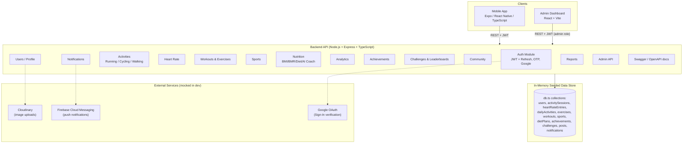
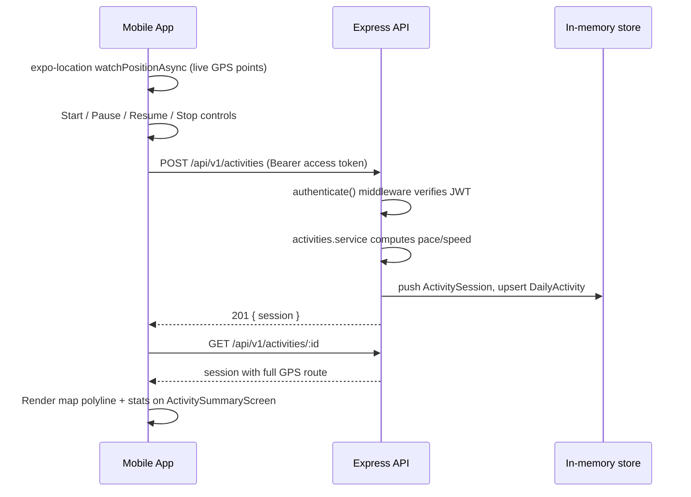
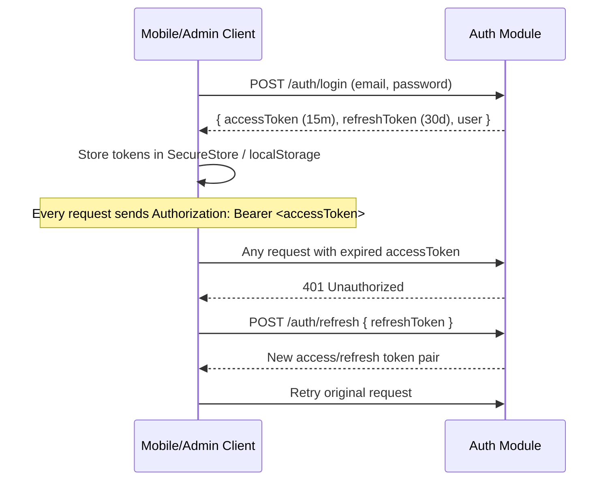

# Thala - Architecture

## System Overview

## Request flow (example: completing a run)

## Auth flow (JWT access + refresh)

## Why an in-memory seeded store instead of a real database

The spec asked for the project to "run without modification" and be delivered with seed/mock data.
Using a small typed in-memory store (`backend/src/data/db.ts` + `seed.ts`) means:

- Zero external setup (no MongoDB/Postgres instance, no connection strings) - `npm install && npm run dev` works immediately.
- Deterministic demo data (fixed seeded users, 28 days of activity history, exercises, sports, etc.)
- Each module only touches `db.<collection>`, so swapping in a real database later means replacing
  `db.ts` with a repository backed by Mongoose/Prisma - controller and route code does not change.

## Frontend architecture (mobile)

- **Navigation**: `AuthNavigator` (onboarding/login/register/OTP) vs `MainTabNavigator` (5 tabs) + a
  `RootNavigator` stack for every detail screen, switched by Redux auth status.
- **State**: Redux Toolkit for auth/session + UI preferences (theme, language, notifications toggle);
  React Query for all server state (caching, refetch, pagination).
- **API layer**: one file per backend module in `src/api/`, all going through a single axios instance
  with a request interceptor (attaches the access token) and a response interceptor (silently retries
  once via `/auth/refresh` on 401, then logs the user out if that also fails).
